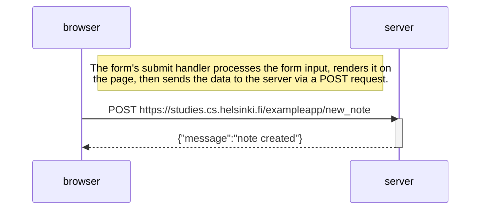

```mermaid
sequenceDiagram
    participant browser
    participant server

    Note right of browser: The form's submit handler processes the form input, renders it on <br>the page, then sends the data to the server via a POST request.

    browser->>server: POST https://studies.cs.helsinki.fi/exampleapp/new_note
    activate server
    server-->>browser: {"message":"note created"}
    deactivate server
```
